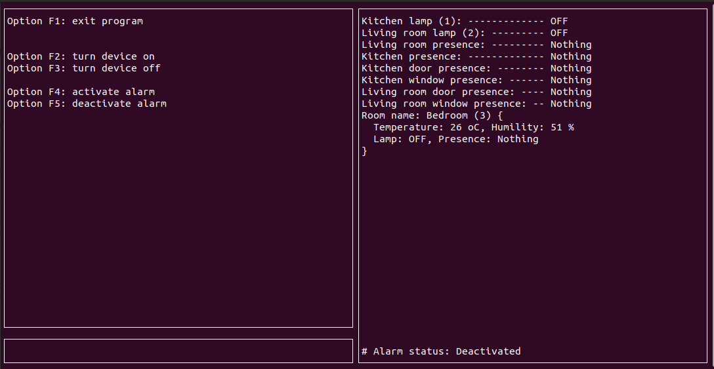

Projeto Final - Fundamentos de Sistemas Embarcados 2020.1 - UnB - Gama
=========================
Andre Lucas de Sousa Pinto  - 17/0068251

Leonardo de Araujo Medeiros - 17/0038891

#

Notas:

* O servidor central **precisa** ser executado primeiro.

* Instrucoes para rodar o servidor central e o servidor distribuido no README dentro de suas respectivas pastas;

* O programa gera 2 logs, um arquivo guardando os comandos do usuario e o outro guardando o acionamento de alarmes. Ao serem gerados ficarao na pasta CentralServer

#

## Images

Screenshot (Central Server)

___
Mais informações em [FSE - Projeto Final](https://gitlab.com/fse_fga/projetos/trabalho-final)

